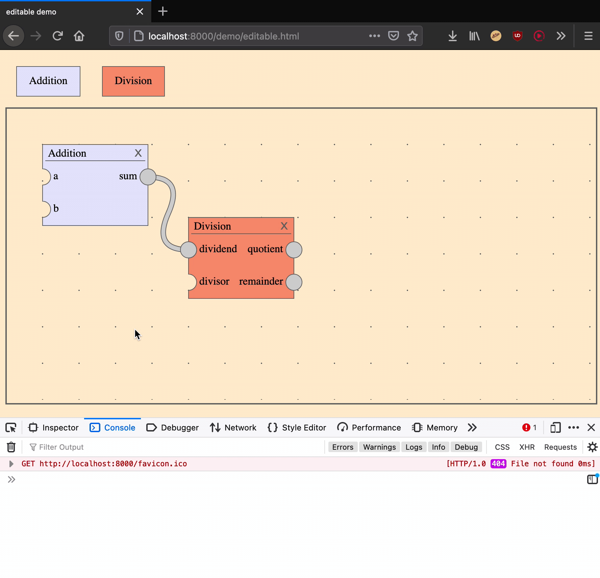

# react-dataflow-editor

> ✨ You can read about the design of this component in [this blog post](https://research.protocol.ai/blog/2021/designing-a-dataflow-editor-with-typescript-and-react/)!

## Table of Contents

- [Demo](#demo)
- [Installation](#installation)
- [Example](#example)

## Demo

- [Editable demo](https://joeltg.github.io/react-dataflow-editor/demo/editable.html) ([source](./demo/editable.tsx))
- [Read-only demo](https://joeltg.github.io/react-dataflow-editor/demo/readonly.html) ([source](./demo/readonly.tsx))



## Installation

```
npm i react-dataflow-editor
```

## Example

```typescript
import React, { useCallback } from "react"
import {
	Editor,
	EditorState,
	GetSchema,
	EditorAction,
	reduce,
} from "react-dataflow-editor"

// Define a catalog of node *kinds* in this format
const kinds = {
	add: {
		name: "Addition",
		inputs: { a: null, b: null },
		outputs: { sum: null },
		backgroundColor: "lavender",
	},
	div: {
		name: "Division",
		inputs: { dividend: null, divisor: null },
		outputs: { quotient: null, remainder: null },
		backgroundColor: "darksalmon",
	},
}

// Derive a concrete type-level schema from the kinds catalog
type S = GetSchema<typeof kinds>

interface MyEditorProps {
	state: EditorState<S>
	onChange: (state: EditorState<S>) => void
}

function MyEditor(props: MyEditorProps) {
	// The editor component takes a dispatch callback, not an onChange
	// callback like most controlled react components.
	// Use the `reduce` method to apply an action to a state.
	const dispatch = useCallback(
		(action: EditorAction<S>) => {
			props.onChange(reduce(kinds, props.state, action))
		},
		[props.onChange, props.state]
	)

	return <Editor<S> kinds={kinds} state={state} dispatch={dispatch} />
}
```
